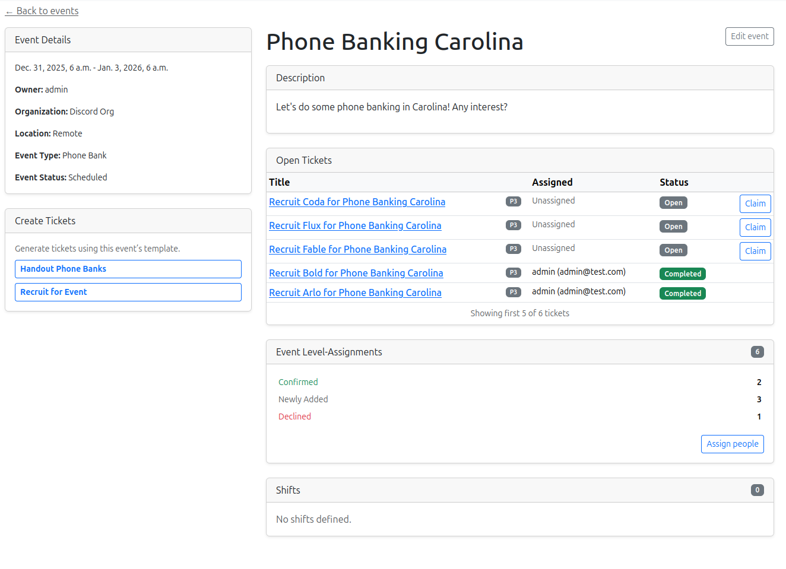
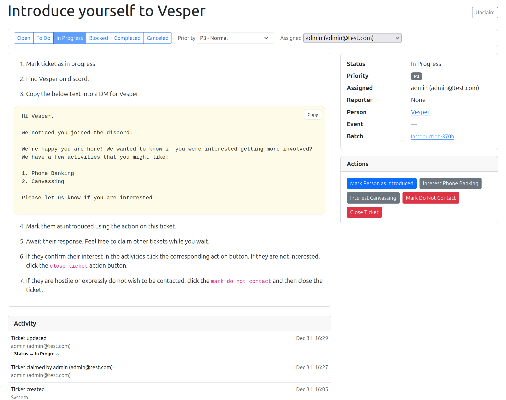
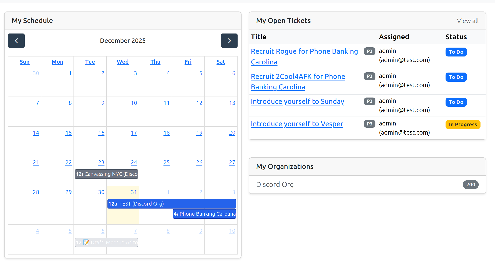

# Open Volunteer

Volunteer organizational software

License: BSD

## What is this?

Open Volunteer allows organizations to track and assign volunteers to activities and manage the lifecycle of these same volunteers.

For example, here's a view of a phone banking event managed in the UI. Notice how you can track the status of assignees (Confirmed, declined, etc). You also have tickets which can be assigned to particular events:



Tickets will help users to complete important outreach tasks and track outreach to volunteers:



The idea is that we can assign tickets to users, who will work through these tickets to accomplish auditable and real goals:



## Basic Commands

All local development requires `docker` to run locally.

### Setting up local stack

To start the local dev environment, first run:

```
docker compose -f docker-compose.local.yml up
```

This brings up all the containers required for local development:

1. Django
2. Postgres
3. Celery
4. Redis
5. Node
6. etc etc

### Setting Up Your Users

- To create a **normal user account**, just go to Sign Up and fill out the form. Once you submit it, you'll see a "Verify Your E-mail Address" page. Go to your console to see a simulated email verification message. Copy the link into your browser. Now the user's email should be verified and ready to go.

```
$ docker logs openvolunteer_local_django
...
To: libdough@destiny.gg
Date: Wed, 31 Dec 2025 04:50:52 -0000
Message-ID: <176715665223.25.4790457677486040098@3ed59bd90a5c>

Hello from Open Volunteer!

You're receiving this email because user libdough has given your email address to register an account on example.com.

To confirm this is correct, go to http://localhost:3000/accounts/confirm-email/Mg:1vaoAe:aqYqcasuNQti1rFVLkKfMwpJRCFX12Joepn-HiZPRjU/
```

Copying this link into the browser will create the user

- To create a **superuser account**, use this command:

```
docker compose -f docker-compose.local.yml run --rm django python manage.py createsuperuser
```

For convenience, you can keep your normal user logged in on Chrome and your superuser logged in on Firefox (or similar), so that you can see how the site behaves for both kinds of users.

### DB Migrations

Any change to a models.py file will require creating new DB migrations

```
docker compose -f docker-compose.local.yml run --rm django python manage.py makemigrations
```

The above will create the relevant migration files for all modules in this repository. To actually run the migrations, use the following:

```
docker compose -f docker-compose.local.yml run --rm django python manage.py migrate
```

Assuming that

### Reset local dev

If you need to, it might be useful to reset the local dev environment:

```
docker compose -f docker-compose.local.yml down -v
```

This will drop all volumes and reset everything. This allows you to start completely from scratch

### Run unit tests

> TODO: Implement docs for unit tests

<!-- ### Type checks

Running type checks with mypy:

    uv run mypy openvolunteer

### Test coverage

To run the tests, check your test coverage, and generate an HTML coverage report:

    uv run coverage run -m pytest
    uv run coverage html
    uv run open htmlcov/index.html

#### Running tests with pytest

    uv run pytest

### Live reloading and Sass CSS compilation

Moved to [Live reloading and SASS compilation](https://cookiecutter-django.readthedocs.io/en/latest/2-local-development/developing-locally.html#using-webpack-or-gulp).

 -->
